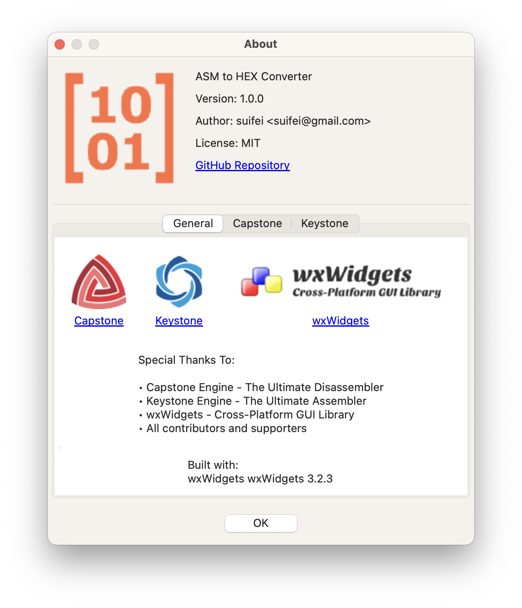
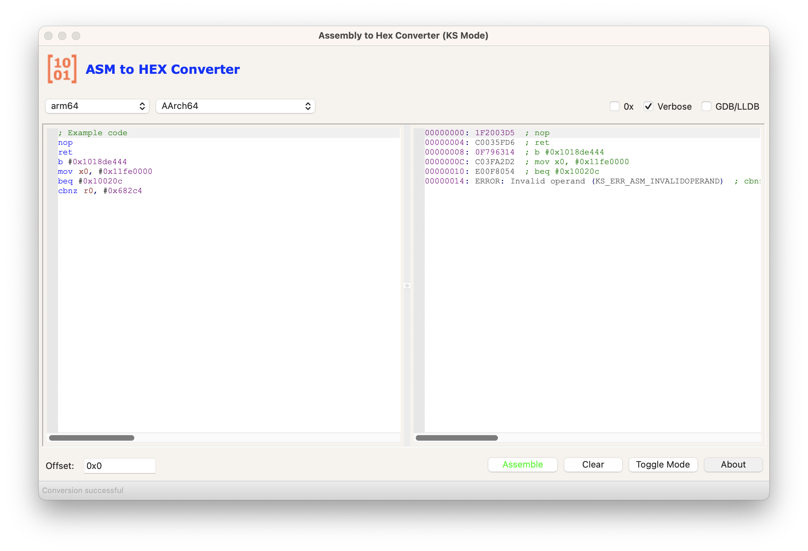
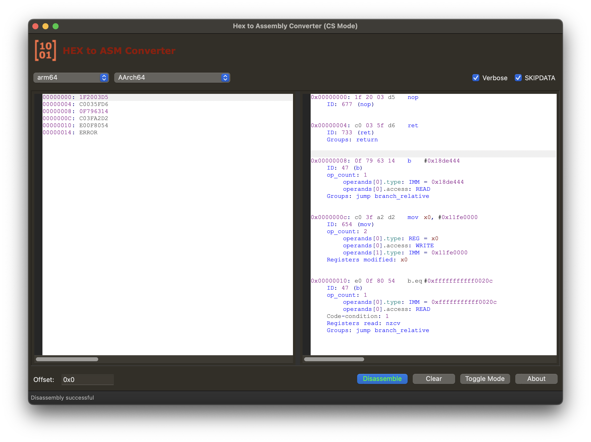

# ASM2HEX Converter
The new version is refactored using C++ (cpp), while the original version was developed using Golang.
A cross-platform GUI tool for converting between Assembly and Machine Code (Hex), powered by [Keystone Engine](https://www.keystone-engine.org) and [Capstone Engine](https://www.capstone-engine.org).





## Features

- **Bi-directional Conversion**: Convert between Assembly and Machine Code (Hex)
- **Multi-Architecture Support**:
  - x86/x64
  - ARM/ARM64
  - MIPS
  - PowerPC
  - SPARC
  - SystemZ
  - And more...
- **Detailed Instruction Information**: View detailed instruction analysis when disassembling
- **Syntax Highlighting**: For both Assembly and Hex code
- **Cross-Platform**: Supports Windows and macOS/Linux
- **User-Friendly Interface**: Built with wxWidgets for native look and feel

## Usage

1. Select your target architecture and mode
2. Choose conversion direction (ASM to HEX or HEX to ASM)
3. Enter your input code
4. Click "Convert" to see the results
5. View detailed instruction information in verbose mode

### Options

- **0x**: Display hex values with "0x" prefix
- **Verbose**: Show detailed instruction information
- **GDB/LLDB**: Use GDB/LLDB syntax style
- **SKIPDATA**: Continue disassembling after invalid instructions

## Building from Source

### Prerequisites

- CMake (3.x or later)
- C++ Compiler with C++11 support
- wxWidgets (3.x)
- Keystone Engine
- Capstone Engine

### Windows

```bash
mkdir build
cd build
cmake ..
cmake --build .
```

### macOS

```bash
mkdir build
cd build
cmake ..
make
```

## Dependencies

- [wxWidgets](https://www.wxwidgets.org/): Cross-platform GUI toolkit
- [Keystone Engine](https://www.keystone-engine.org): Assembler framework
- [Capstone Engine](https://www.capstone-engine.org): Disassembler framework

## License

This project is licensed under the MIT License - see the [LICENSE](LICENSE) file for details.

## Acknowledgments

- Keystone Engine team
- Capstone Engine team
- wxWidgets team
- All contributors and supporters

## Author

suifei (c3VpZmUgQGdtYWlsIGRvdGNvbQ==)

QQ group:555354813

## Contributing

Contributions are welcome! Please feel free to submit pull requests.

1. Fork the repository
2. Create your feature branch (`git checkout -b feature/amazing-feature`)
3. Commit your changes (`git commit -m 'Add some amazing feature'`)
4. Push to the branch (`git push origin feature/amazing-feature`)
5. Open a Pull Request

## Support

If you encounter any issues or have questions, please [open an issue](https://github.com/suifei/asm2hex/issues).